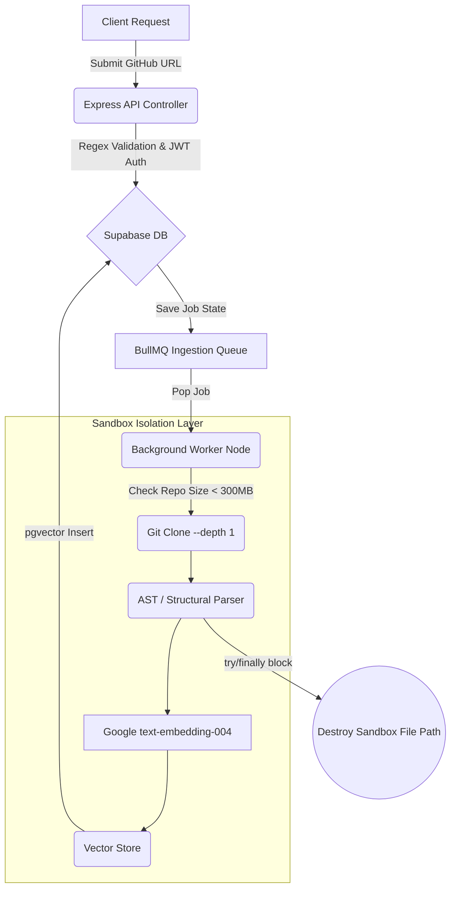
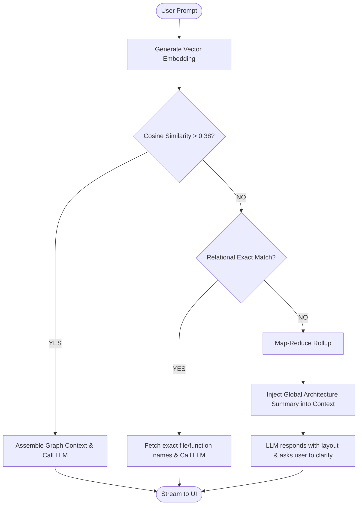

# 🔍 OSSAnalyser

**ossAnalyser** is an asynchronous, multi-tenant GraphRAG engine built to safely ingest, structurally parse, and intelligently query open-source codebases.

Unlike standard RAG pipelines that blindly slice text, ossAnalyser preserves file structures, execution flows, and architectural hierarchies, allowing Large Language Models to answer cross-file architectural questions with zero hallucination.

---

## 📋 Table of Contents

- [Primary Use Cases](#-primary-use-cases)
- [System Architecture](#️-system-architecture)
- [Tech Stack](#-tech-stack)
- [Technical Decisions & Rationale](#-technical-decisions--rationale)
- [Contributing](#-contributing)

---

## 🎯 Primary Use Cases

1. **Architectural Onboarding:** Instantly understand how routing, authentication, and data layers connect in a massive, undocumented monolithic repository.
2. **Impact Analysis:** Ask *"If I modify the `auth.ts` middleware, which downstream controllers and database schemas are impacted?"* and get structurally grounded answers.
3. **Automated Security Auditing:** Query the codebase for scattered vulnerabilities (e.g., unsanitized raw SQL inputs) that span across multiple files and layers.

---

## 🏗️ System Architecture

### 1. The Ingestion & Sandboxing Pipeline

The ingestion engine is decoupled from the user-facing API to prevent heavy filesystem operations from blocking the Node event loop.

### 2. The 3-Tier Q&A Fallback Engine

When users query the analyzed codebase, standard vector search often fails on hyper-specific structural questions. ossAnalyser implements a resilient 3-tier fallback matrix.

---

## 🧩 Tech Stack

| Layer | Technology |
|---|---|
| Language | TypeScript (strict, ESM/`nodenext`) |
| API Server | Node.js + Express |
| Database | Supabase (PostgreSQL + `pgvector`) |
| Job Queue | BullMQ + Redis |
| Embeddings | Google `text-embedding-004` (Gemini) |
| Auth | Supabase JWT, verified in Express middleware |

---

## 🧠 Technical Decisions & Rationale

### 1. Strict TypeScript (ESM) + Express

* **The Decision:** Configured `tsconfig.json` with `"module": "nodenext"` and `"verbatimModuleSyntax": true`, mandating strict `.js` extension resolutions in relative imports.
* **The Why:** Enforces strict boundary contracts. Silent module resolution failures are caught at compile-time rather than crashing the ingestion pipeline at runtime.

### 2. Job Orchestration via BullMQ + Redis

* **The Decision:** Decoupled GitHub cloning and AST parsing into background workers using BullMQ.
* **The Why:** Cloning and parsing a 200MB repository can take several minutes, which would trigger HTTP timeout limits if done synchronously. BullMQ's explicit exponential backoff (`delay: 5000`) and aggressive memory management (`removeOnComplete: 100`) prevent the Redis instance from OOM (Out of Memory) crashes during high traffic.

### 3. Isolated Sandboxing & Security Guardrails

* **The Decision:** Implemented native child process execution (`git clone`) protected by strict regex URL sanitization, a maximum repository size limit (≤ 300MB rejection), and `try/finally` workspace deletion.
* **The Why:** Untrusted user input (GitHub URLs) opens the system to shell injection attacks (e.g., `; rm -rf /`). Pre-flight regex validation sanitizes input, while deterministic temporary folder deletion prevents the host server from running out of disk space during multi-tenant ingestion spikes.

### 4. Supabase (PostgreSQL + pgvector) for Multi-Tenancy

* **The Decision:** Intercepted Supabase JWTs inside custom Express middleware (`req.user`) before hitting downstream logic.
* **The Why:** Eliminates unauthorized cross-tenant data leaks. By blending traditional relational querying (for exact keyword/path matching) with `pgvector` (for semantic search), the application leverages a unified database connection pool without needing separate infrastructure for vector math.

### 5. GraphRAG vs. Naive Text Chunking

* **The Decision:** Instead of slicing code into arbitrary 500-token chunks (which splits function definitions in half), the ingestion pipeline uses AST-aware logic to map nodes (Functions, Classes) and edges (Imports, Calls).
* **The Why:** Code is structural, not semantic. Preserving the exact boundary of a React component or an Express controller ensures the LLM receives unbroken logical context.

---

## 🤝 Contributing

Contributions are welcome. If you'd like to help improve ossAnalyser:

1. Fork the repository
2. Create a feature branch (`git checkout -b feature/your-feature`)
3. Commit your changes with clear messages
4. Open a pull request describing what you changed and why

Please open an issue first for larger changes so they can be discussed before implementation.

